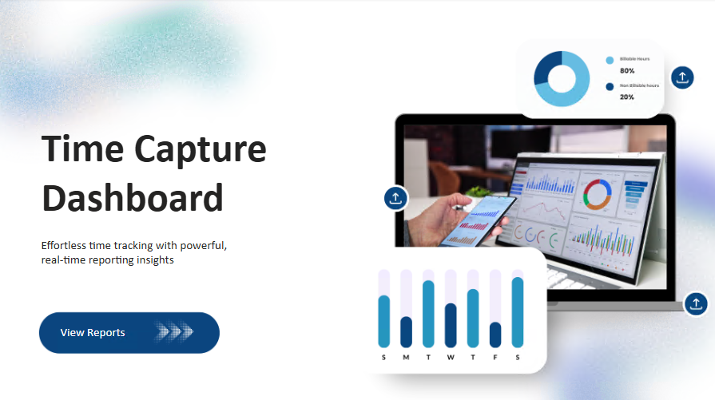
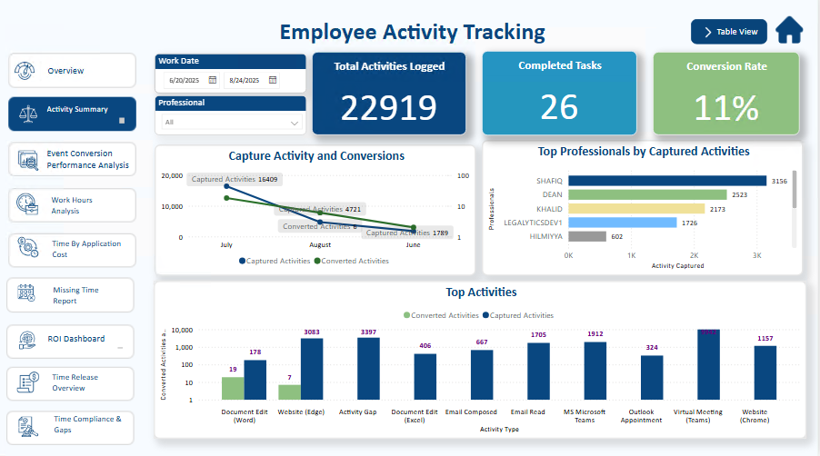
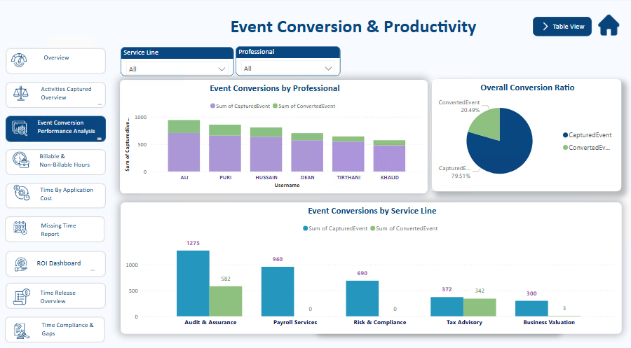
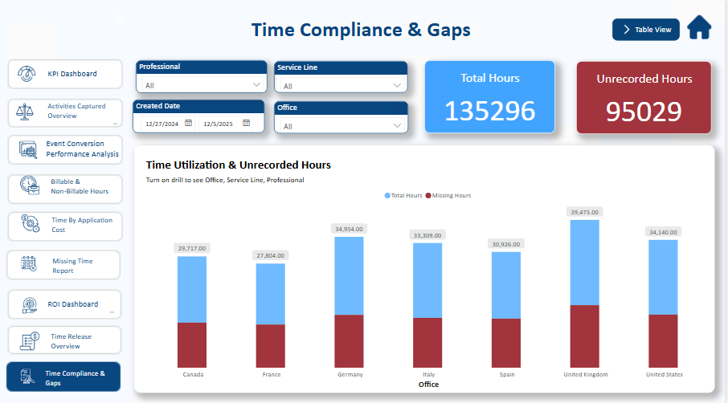
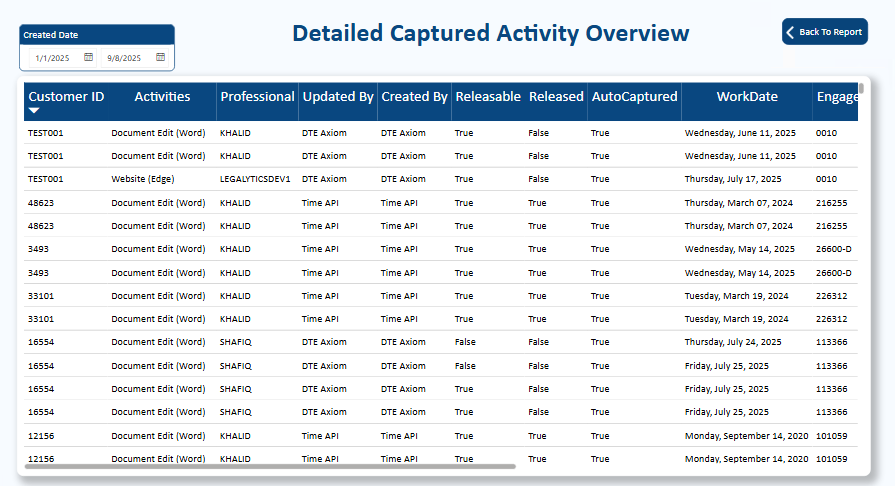

# 📊 Power BI Activity & Conversion Dashboard

## 📌 Description

This project analyzes employee activities and conversion performance using Power BI. It provides insights into productivity, service line performance, and overall efficiency.

## 🚀Features

* Activity tracking
* Conversion analysis
* KPI dashboards
* Service line insights

## 🛠️ Tools Used

* Power BI
* DAX
* Data Modeling
* SQL

## 📈 Key Insights

* Identified low conversion areas
* Highlighted top-performing professionals
* Analyzed service line performance trends

## 🖼️ Dashboard Preview

### Cover Page

### Employee Activity

### Event Conversion

### Gap Analysis

### Detailed Activity

##  Author

**Ansa Maqsood**
Aspiring Data Analyst | Power BI | SQL | Data Visualization
